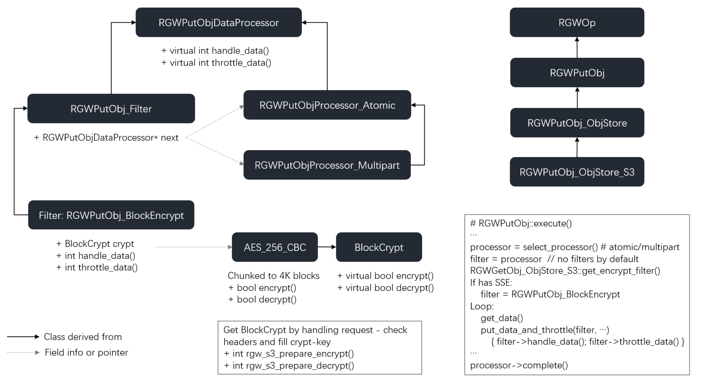

**信封加密(Envelope Encryption)**

“信封”的含义是指：将加密密钥（DEK）密文和加密后的业务数据打包在一起，形如一个“信封”。在实施信封加密的过程中，KMS只负责对DEK进行加解密，实际的业务数据的加解密操作都在云产品本地内存中完成，所以对业务的性能影响很小。

信封加密的流程如下：  

1）通过KMS为用户创建默认的用户主密钥CMK（或者用户指定自己的CMK）  

2）通过CMK 调用 GenerateDataKey 接口生成数据加密密钥 DEK，DEK 受CMK 加密保护  

3）DEK的明文缓存在云产品后台服务的内存中在本地对租户数据进行加解密，DEK密文由云产品自行落盘保存 

4）DEK缓存过期或者服务重启时，通过kms.Decrypt 接口解密获取DEK明文，缓存在内存中使用

则KMS加密解密基本流程如图2所示：

图2中名词解释：

> key_id： 即上文中的CMK，可由用户指定，也可由KMS自动分配。
>
> plainkey: 即上文中的DEK明文，用于加密和解密用户数据。
>
> cipherkey: 即上文中的DEK密文，用于解密后获取DEK明文。
>
> actual_key：base64解密后的plainkey。
>
> role: 0：用户自定义密钥， 1：云产品密钥（一般只有一个，不会有多个）主要用于keyid为空的情况。
>
> 两者都是在kms中生成管理，下图中描述不恰当



```c++
//保存到RGWEnv中
class RGWEnv {
  std::map<string, string, ltstr_nocase> env_map;
  
//rgw_crypt.cc
typedef enum {
  X_AMZ_SERVER_SIDE_ENCRYPTION_CUSTOMER_ALGORITHM=0,
  X_AMZ_SERVER_SIDE_ENCRYPTION_CUSTOMER_KEY,
  X_AMZ_SERVER_SIDE_ENCRYPTION_CUSTOMER_KEY_MD5,
  X_AMZ_SERVER_SIDE_ENCRYPTION,
  X_AMZ_SERVER_SIDE_ENCRYPTION_AWS_KMS_KEY_ID,
  X_AMZ_SERVER_SIDE_ENCRYPTION_LAST
} crypt_option_e;

//rgw_crypt.cc
//确定是否需要使用SSE. 从env中得到crypt attribute.此处主要用于判断object copy不能处理SSE的特殊情况判断.
bool rgw_s3_is_sse_req(struct req_state* s){
  //...
  req_sse = get_crypt_attribute(env, nullptr, X_AMZ_SERVER_SIDE_ENCRYPTION_CUSTOMER_ALGORITHM);
}

//rgw_rest_s3.cc
//在其中调用rgw_s3_is_sse_req进行判断
RGWPutObj_ObjStore_S3::get_params()
  

//Put Obj执行过程  
void RGWPutObj::execute(){
  //filter用于对数据进行处理, 如加密和压缩
  RGWPutObjDataProcessor *filter = nullptr;
  std::unique_ptr<RGWPutObjDataProcessor> encrypt;
  //用于存储用户提供的md5,计算MD5相关的数据
  char supplied_md5_bin[CEPH_CRYPTO_MD5_DIGESTSIZE + 1];
  char supplied_md5[CEPH_CRYPTO_MD5_DIGESTSIZE * 2 + 1];
  char calc_md5[CEPH_CRYPTO_MD5_DIGESTSIZE * 2 + 1];
  unsigned char m[CEPH_CRYPTO_MD5_DIGESTSIZE];
  
  //...

/*
sse相关，如果用户设置了sse，则进行加密的准备
OP执行层会调用get_encrypt_filter获取一个加密用的Filter，取代原Processor进行数据处理，
这个Filter即为 RGWPutObj_BlockEncrypt 。调用 get_encrypt_filter 时，需要将相关的crypt信息填充在BlockCrypt中，
同时保存原Processor在next中。RGWPutObj_BlockEncrypt Filter中的 handle_data 和 throttle_data 除了进行数据加密操作外，
还会调用原Processor的函数（如next->handle_data），将加密后的数据交给原Processor进行后续处理，从而完成和RADOS的交互（IO操作）。

get_encrypt_filter，包括下文的 get_decrypt_filter 函数，都是负责生成加/解密用的Filter。
它们通过调用 rgw_s3_prepare_decrypt/encrypt 函数，获取crypt信息并保存在Filter中，同时在Filter中记录原Processor信息。
  */
  op_ret = get_encrypt_filter(&encrypt, filter);
}
  
int rgw_s3_prepare_encrypt(struct req_state* s,
                           std::map<std::string, ceph::bufferlist>& attrs,
                           std::map<std::string,
                                    RGWPostObj_ObjStore::post_form_part,
                                    const ltstr_nocase>* parts,
                           std::unique_ptr<BlockCrypt>* block_crypt,
                           std::map<std::string, std::string>& crypt_http_responses)
  
//不断从请求体读取数据，经过filter处理后，交由Atomic或Multipart类做分片和写入操作
//此处为关键操作, filter依据情况分为Atomic/Multipart, 另外,若有SSE, 则为 RGWPutObj_BlockEncrypt.
// handle_data最终调用`store->aio_put_obj_data`函数，将对象写入rados
static inline int put_data_and_throttle(RGWPutObjDataProcessor *processor,
					bufferlist& data, off_t ofs,
					bool need_to_wait)
{
  bool again = false;
  do {
    void *handle = nullptr;
    rgw_raw_obj obj;

    uint64_t size = data.length();
    //# processor can be RGWPutObj_BlockEncrypt if SSE enabled
    // 若SSE开启,则processor为 RGWPutObj_BlockEncrypt.
    //[关键] handle指针指向aio返回的对象，可以通过handle得知aio是否完成
    int ret = processor->handle_data(data, ofs, &handle, &obj, &again);
    if (ret < 0)
      return ret;
    if (handle != nullptr)
    {
      // 将obj和handle封装后放入 Aio 类的pending队列
      // 并根据window_size限制pending队列的大小
      ret = processor->throttle_data(handle, obj, size, need_to_wait);
      if (ret < 0)
        return ret;
    }
    else
      break;
    need_to_wait = false; /* the need to wait only applies to the first
			   * iteration */
  } while (again);

  return 0;
} /* put_data_and_throttle */
 
//加密解密相关代码在rgw_crypt.cc中.
//若SSE开启,处理数据的接口为:RGWPutObj_BlockEncrypt::handle_data
//在其中将会调用真正的加密流程crypt->encrypt()
int RGWPutObj_BlockEncrypt::handle_data(bufferlist& bl,
                                        off_t in_ofs,
                                        void **phandle,
                                        rgw_raw_obj *pobj,
                                        bool *again);
	//具体的crypt->encrypt的调用取决于 rgw_s3_prepare_encrypt 时的传入 block_crypt 接口
std::unique_ptr<BlockCrypt> block_crypt;
res = rgw_s3_prepare_encrypt(s, attrs, nullptr, &block_crypt, crypt_http_responses);
 
//可以看到加密方式都是AES_256_CBC(这种模式是先将明文切分成若干小段，然后每一小段与初始块或者上一段的密文段进行异或运算后，再与密钥进行加密), 还有一种AES_256_CTR,看起来未被用到.
  if (block_crypt) {
        auto aes = std::unique_ptr<AES_256_CBC>(new AES_256_CBC(s->cct));
        aes->set_key(reinterpret_cast<const uint8_t*>(key_bin.c_str()), AES_256_KEYSIZE);
        *block_crypt = std::move(aes);
}
```


# bucket encryption

## 测试脚本

```shell
#!/bin/bash

S3_HOST=http://localhost:8000
CONF=/data/sherlocwang/sherloc_Dawa/Dawa/build/ceph.conf
BUCKET="bucket0"
function create_bucket(){
    aws s3api --endpoint-url $S3_HOST \
        create-bucket --bucket $BUCKET
}

function list_bucket(){
   aws s3api --endpoint-url $S3_HOST \
        list-buckets
}

function put_bucket_encryption(){
    aws s3api --endpoint-url $S3_HOST \
        put-bucket-encryption \
        --bucket $BUCKET \
        --server-side-encryption-configuration '{"Rules": [{"ApplyServerSideEncryptionByDefault": {"SSEAlgorithm": "AES256"}}]}'
}

function main(){
    create_bucket
    list_bucket
    put_bucket_encryption
}
main
```


## 测试项目与预期结果

| 序号 | 项目                                                         | 序列                                                         | 预期                                                         |
| ---- | ------------------------------------------------------------ | ------------------------------------------------------------ | ------------------------------------------------------------ |
| 1    | 基本功能                                                     | a. put bucket encryption S3/KMS<br />b. get bucket encryption S3/KMS<br />c. delete bucket encryption S3/KMS | 正常PUT、GET、DELETE操作，使用aws cli工具能够返回正常值      |
| 2.   | 多次get                                                      | a. put bucket encryption S3/KMS<br />b.get bucket encryption S3/KMS 多次 | PUT后，多次GET均能返回正确结果                               |
| 3    | 多次put相同配置                                              | a. put bucket encryption S3/KMS多次<br />b. get bucket encryption | 多次PUT相同配置，GET时都能返回正确结果                       |
| 4    | 更改配置S3->KMS                                              | a. put bucket encryption S3<br />b. put bucket encryption KMS<br />c. get bucket encryption | 后PUT的操作覆盖先PUT的配置，在GET时能返回后PUT的配置         |
| 5    | 更改配置KMS->S3                                              | a. put bucket encryption KMS<br />b. put bucket encryption S3 | 后PUT的操作覆盖先PUT的配置，在GET时能返回后PUT的配置         |
| 6    | 通过bucket encryption配置简单上传                            | a. put bucket encryption S3/KMS<br />b. PUT object           | bucket encryption配置成功，在API中不包含相应头也可以按照Bucket encryption的配置SSE上传 |
| 7    | 使用API覆盖bucket encryption配置简单上传                     | a. put bucket encryption S3/KMS<br />b. put object KMS/S3    | bucket encryption配置成功，API中的配置可以覆盖bucket encryption的配置 |
| 8    | 通过bucket encryption配置分片上传                            | a. put bucket encryption S3/KMS<br />b.put object multipart  | bucket encryption配置成功，在API中不包含相应头也可以按照Bucket encryption的配置SSE上传 |
| 9    | 使用API覆盖bucket encryption配置分片上传                     | a. put bucket encryption S3/KMS<br />b. put object multipart KMS/S3 | bucket encryption配置成功，API中的配置可以覆盖bucket encryption的配置 |
| 10   | TCE环境下S3 bucket encryption测试                            | a. put bucket encryption S3<br />b. 简单上传、分片上传 object | bucket encryption配置成功，API中的配置可以覆盖bucket encryption的配置 |
| 11   | TCE环境下KMS bucket encryption测试==（COS SDK暂不支持SSE-KMS，故无法测试）== | a. put bucket encryption KMS<br />b. 简单上传、分片上传 object | bucket encryption配置成功，API中的配置可以覆盖bucket encryption的配置 |
| 12   | KMS key_id头部转换==（COS SDK暂不支持SSE-KMS，故无法测试）== | 使用COS SDK通过SSE-KMS携带key_id上传对象，<br />             | x-cos-server-side-encryption-cos-kms-key-id将被转换为x-amz-server-side-encryption-aws-kms-key-id，能够正常进入SSE-KMS处理流程 |
| 13   | 多个rgw                                                      | 使用某个rgw写入bucket encryption配置，使用其他rgw可以正确读出 | 使用某个rgw写入bucket encryption配置，使用其他rgw可以正确读出 |
| 14   | bucket policy CAM                                            |                                                              |                                                              |

## 置顶：前后端联调内测

# 9.参考

1. Ceph官网 SSE: https://docs.ceph.com/en/latest/radosgw/encryption/
4. AWS官方文档: SSE-C: https://docs.aws.amazon.com/AmazonS3/latest/dev/ServerSideEncryptionCustomerKeys.html
5. AWS官方文档:SSE-kms: https://docs.aws.amazon.com/AmazonS3/latest/dev/KMSUsingRESTAPI.html
7. AWS 数据加密知识点 https://blog.csdn.net/wangzan18/article/details/107140548?utm_medium=distribute.pc_relevant.none-task-blog-title-1&spm=1001.2101.3001.4242
8. 使用服务器端加密保护数据 https://docs.aws.amazon.com/zh_cn/AmazonS3/latest/dev/serv-side-encryption.html
9. 使用AWS SDK for Java实现SSE-C加密: https://docs.aws.amazon.com/zh_cn/AmazonS3/latest/dev/sse-c-using-java-sdk.html
10. 名词解释, 基本流程: https://segmentfault.com/a/1190000017322273
11. AWS上的数据加密策略, 顶层设计: http://blog.light2cloud.com/?p=94
12. KMS加密解密, CMK, 信封加密, KMI: https://www.cnblogs.com/chanix/p/12739024.html
13. 使用具有 AWS Key Management Service 中存储的 CMK 的服务器端加密 (SSE-KMS) 保护数据 https://docs.aws.amazon.com/zh_cn/AmazonS3/latest/dev/UsingKMSEncryption.html
14. AWS https://amazonaws-china.com/cn/blogs/security/how-to-prevent-uploads-of-unencrypted-objects-to-amazon-s3/
15. Ceph 文档:Server-Side Encryption: https://www.bookstack.cn/read/ceph-en/6bcca8c85dc70376.md
16. 案例: 使用aws-cli对Minio服务端进行SSE-C加密: https://www.bookstack.cn/read/MinioCookbookZH/74279
17. AES加密课程: https://www.youtube.com/watch?v=NHuibtoL_qk
18. AES五种加密方式简介: https://www.cnblogs.com/starwolf/p/3365834.html
19. AWS KMS管理： https://d0.awsstatic.com/whitepapers/aws-kms-best-practices.pdf
20. AWS Key Management Service**Developer Guide**: https://docs.amazonaws.cn/en_us/kms/latest/developerguide/kms-dg.pdf
21. kms encryption context的使用： https://blog.eyallupu.com/2018/01/encryption-context-aad-with-aws-kms.html

# 

