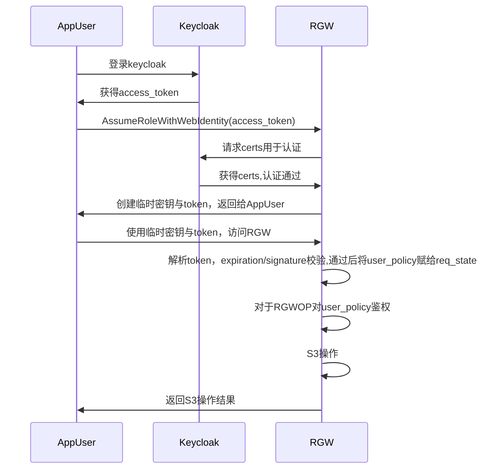
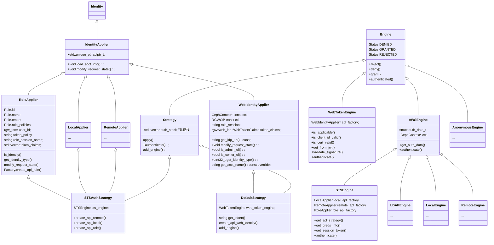

# AssumeRoleWithWebIdentity

[TOC]

## 可能的问题

1. 目前AssumeRoleWithWebIdentity功能仅在O版以上支持，涉及WebIdentityApplier相关的改动，backport到N版的话代码量可能有5k多行左右，兼容性问题未知。

2. 目前官网上仅与keycloak有集成测试，使用OIDC协议的其他Provider可能也可以（暂未测试），需根据客户需求详细调查。

3. While this whole process seems quite long-winded it takes place in milliseconds and once a client has a session open that application or user can use the token for as long as the session lifetime is specified for.

   There are a couple of limitations today in Nautilus and Octopus for using STS with radosgw, and these revolve around multi-tenancy support and multiple role support. While these are both still under development we don’t expect to see them upstream in Ceph until at least the Pacific release. In the meantime, if we’re looking to do multi-tenancy or a mature list of role policies we can use a standalone OpenStack Keystone instance to bridge the gap and handle the OIDC connection on our behalf.

   > https://softiron.com/blog/integrating-rados-gateway-with-an-external-oidc-provider/

## 主要代码提交

[rgw: Initial commit for AssumeRoleWithWebIdentity.](https://github.com/ceph/ceph/commit/463c5603bd3e836fd504b9be212ee1e0e640948e)

[rgw: Added code for auth using temp credentials returned by STS.](https://github.com/ceph/ceph/commit/001f0577135f2932b9a16bf0ec6ec9b1f6b06424)

[octopus: rgw: adds code for creating and managing oidc provider entities in rgw and for offline validation of OpenID Connect Access and ID Token](https://github.com/ceph/ceph/pull/37640)

[rgw: adds REST APIs for OpenID connect providers manipulation.](https://github.com/ceph/ceph/commit/a92a68b5fb554ee1b965de24106af15f004092aa)

## 参考文档

OIDC：https://blog.csdn.net/iamlake/article/details/93415206

OAuth2.0 Authorization Framework: https://datatracker.ietf.org/doc/html/rfc6749#section-3.2

使用keycloak实现k8s用户权限的统一管理： https://cloud.tencent.com/developer/article/1680759

Keycloak 13自定义用户身份认证流程：https://blog.51cto.com/u_12857552/2796318

[STS in Ceph](https://docs.ceph.com/en/latest/radosgw/STS/)：这是v:latest版本的doc，所述的keyclock在octopus中集成，但还未在nautilus中集成。

aws的AssumeRoleWithWebIdentity在线体验：[aws: Web Identity Federation Playground:]( https://web-identity-federation-playground.s3.amazonaws.com/index.html)

[youtube:Pritha Srivastava: STS in Ceph](https://www.youtube.com/watch?v=U70FB6mlKNY)

[youtube: aws re:Invent, STS](https://www.youtube.com/watch?v=YQsK4MtsELU)

[youtube: ceph sts](https://www.youtube.com/watch?v=U70FB6mlKNY)

awscli 针对iam的接口：https://docs.aws.amazon.com/cli/latest/reference/iam/add-client-id-to-open-id-connect-provider.htmlaws sts assume-role-with-web-identity](https://docs.aws.amazon.com/fr_fr/cli/latest/reference/sts/assume-role-with-web-identity.html).

AssumeRoleWithWebIdentity社区问答：

>https://www.spinics.net/lists/ceph-users/msg62804.html
>
>https://www.spinics.net/lists/ceph-users/msg62736.html
>
>https://www.spinics.net/lists/ceph-users/msg62812.html
>
>https://www.spinics.net/lists/ceph-users/msg62824.html

## OIDC基本概念

OIDC是基于OAuth2+OpenID整合的新的认证授权协议; OAuth2是一个授权(authorization)的开放协议, 在全世界得到广泛使用, 但在实际使用中,OAuth2只解决了授权问题, 没有实现认证部分,往往需要添加额外的API来实现认证; 而OpenID是一个认证(authentication )的协议, 二者在实际使用过程中都有其局限性;

综合二者,即是OIDC; 通过OIDC,既能有OAUTH2的功能,也有OpenID的功能就是在 OAuth2 上多做了一个身份层，是一个基于 OAuth2 协议的身份认证标准协议。OIDC 使用 OAuth2 的授权服务器来为第三方客户端提供用户的身份认证，并把对应的身份认证信息传递给客户端，且可以适用于各种类型的客户端（比如服务端应用，移动APP，前端 SPA ），且完全兼容 OAuth2。

OIDC基本流程如下所示：[来源](https://openid.net/specs/openid-connect-core-1_0.html#Terminology)

- **EU** End-User, 指用户(一般指有账号的个体，资源的拥有者)。==此处指在keycloak中创建出来的User。==
- **RP** Relying Party, 信任方(一般是一个软件应用), 理解为OAuth2中的客户端(client)即可, 需要在OP中注册。==此处指keycloak-quick-start demo app-profile-jee-jsp。==
- **OP** OpenID Provider, 能提供对EU进行认证的服务端(可理解为OAuth2中授权服务端),
  提供RP的注册(或管理)能力，EU管理，ID Token的签发与管理等。OIDC中的核心组件。==此处指keycloak。==
- **ID Token** 格式为JSON Web Token([JWT](http://tools.ietf.org/html/draft-ietf-oauth-json-web-token)),
  包含EU认证授权信息等. 有关JWT请访问 https://jwt.io/除了JWT, 知道以下概念对掌握OIDC会很有帮助
  JSON Web Key([JWK](https://tools.ietf.org/html/draft-ietf-jose-json-web-key-41)),
  JSON Web Encryption([JWE](http://tools.ietf.org/html/draft-ietf-jose-json-web-encryption)),
  JSON Web Algorithm([JWA](http://tools.ietf.org/html/draft-ietf-jose-json-web-algorithms)),
  JSON Web Signature([JWS](https://tools.ietf.org/html/draft-ietf-jose-json-web-signature-41))
- **UserInfo Endpoint** EU信息接口(OAuth2保护), 在RP获取到`access_token`后,可调用此接口获取EU的详细信息.
  OIDC要求此接口必须使用https访问(更安全)；一般在OP中提供的[Discovery](https://openid.net/specs/openid-connect-discovery-1_0.html)中获取。==此处指AssumeRoleWithWebIdentity来角色扮演访问Ceph==
- **Claim** EU信息的载体, 可在`id_token`中获取,主要包括认证信息与授权信息，可根据实际扩展


OIDC Provider Entity:

### keycloak

#### realm

把 realm 想像成租户的概念。

`Master realm`: 这个 realm 是初始化时创建的，它包含超级管理员。使用这个 realm 管理其它的 realm。

`Other realm` : 超级管理员创建的 realm 。在这些 realm 里，超级管理员创建用户和应用程序，用户拥有应用程序。一个realm作为一个租户，作为权限管理的基本单位，一个realm下可以创建多个用户，此时多个用户具有相同的权限。详见[Creating a realm and a user](https://www.keycloak.org/docs/latest/getting_started/)。

## CEPH STS与Keycloak交互流程

上面作为一般流程引入一些基本概念，Ceph STS与Keycloak之间的交互流程有些细节不同：

1. 管理IAM账户创建rgw role

   > 需要一个rgw用户（此处以testid为例），赋予caps="roles=*"的权限，作为管理账户。创建一个role，名称为S3Access，并赋予相关policy；

2. shadow iam账户创建open id connect provider entity

   > rgw用户TESTER，赋予caps="oidc-provider=*"权限，作为shadow账户，作为oidc-provider entity，主要保存如下OIDC Provider的Url（指定realms），ClientId，Thumbprint。
   >
   > ```xml
   > {
   > "Url": "http://9.134.3.72:8080/auth/realms/demo",
   > "ClientIDList": [
   >   "app-profile-jsp"
   > ],
   > "ThumbprintList": [
   >   "AC9F85A386436B9EF71B0B2036AAA0E7273B59F1"
   > ]
   > }
   > ```
   >
   > 将负责与keycloak交互认证，以进行角色扮演获得临时密钥。

3. 用户拿到keycloak的access_token

   > 用户访问`http://$KC_SERVER/$KC_CONTEXT/realms/$KC_REALM/protocol/openid-connect/toke`来得到access_token。需要传入client_id（此处示例为app-profile-jsp）和client_secret，需要从keycloak中对应的client管理页面获取。
   >
   > [注]：可以看到这里可能需要HTTPS，因为client_id和client_secret是明文传输的。

4. 用户使用access_token来AssumeRoleWithWebIdentity，拿到tmpAk/tmpSk/token

   > 此处涉及到rgw与keycloak的认证交互。
   >
   > rgw接收到传入的access_token，将使用WebTokenEngin::authenticate进行认证，主要流程为：解析JWT(Json Web Token)，从rgw本地获得provider信息，进行签名校验。
   >
   > 此处的签名实际上就是通过比对之前创建OpenIdProvider entity时写入的Thumbprint与通过GET OpenIdProvider（此处即keycloak）的`/protocol/openid-connect/certs`来进行的。
   >
   > 认证通过后，将会创建随机字符串的tmpAk/tmpSk,并创建一个token，将所需必要信息（access_key_id, secret_access_key, policy, roleId等信息存入。
   >
   > **额外需要一个token的原因：**
   >
   > 因为没有IAM用户实体，无法进行S3用户校验、也无法进行操作签名校验、鉴权、有效期判断等操作，还需要一个token来传递这些信息。

5. 用户使用tmpAk/tmpSk/token访问ceph

   > 进入S3操作时，使用rgw::auth::s3::STSEngine:::authenticate()进行认证，主要操作包括JWT(Json Web Token)解析、过期时间判断、签名校验、加入token中额外带的policy到role。认证通过后，将modify_request_state，将role的policy赋给s->iam_user_policies，用户后面S3操作时进行鉴权。例如普通上传对象的`RGWPutObj::verify_permission`，将在`iam_user_policies.empty`不为空的情况下使用user policy鉴权。

## 交互流程图



## 完整脚本示例

Ceph Octopus+Keycloak

详细安装部署流程见《rgw与keycloak》。

> 官网上的安装流程有部分步骤是错误的。
>
> keycloak-13.0.0无需额外部署WildFly，
>
> 添加keycloak.json配置文件应该在keycloak-quickstarts/app-profile-jee-jsp/config/，而非keycloak-quickstarts/app-profile-jee-jsp/src/main/webapp下
>
> 要求maven版本高于el7源中的提供版本，需要额外下载，手动软链接指向高版本mvn

```shell
#0.在ceph.conf中配置
rgw sts key = rL9FabxCOw5LDbrHtmykiGSCjzpKLmEs9WPiNjVJ
rgw s3 auth use sts = true

#1. 使用TESTER账户，创建openid connect provider
function create_openid_connect_provider(){
aws iam --endpoint-url=$RGW_ENDPOINT \
        --profile $PROFILE \
        --region "chongqing" \
        create-open-id-connect-provider \
        --cli-input-json file://open_id_connect_provider.json
}
{
    "OpenIDConnectProviderArn": "arn:aws:iam:::oidc-provider/9.134.3.72:8080/auth/realms/demo"
}
#2.使用TESTER账户，查看当前openid provider list:
function get_openid_connect_provider(){
aws iam --endpoint-url=$RGW_ENDPOINT \
        --profile $PROFILE \
        --region "chongqing" \
        list-open-id-connect-providers
}
        
{
    "OpenIDConnectProviderList": [
        {
            "Arn": "arn:aws:iam:::oidc-provider/9.134.3.72:8080/auth/realms/demo"
        }
    ]
}
#3.使用TESTER用户，查看当前openid provider:
function get_openid_connect_provider(){
    aws iam --endpoint-url=$RGW_ENDPOINT \
        --region chongqing \
        --profile $PROFILE \
        get-open-id-connect-provider  \
            --open-id-connect-provider-arn $1
}
get_openid_connect_provider "arn:aws:iam:::oidc-provider/9.134.3.72:8080/auth/realms/demo"
{
    "Url": "http://9.134.3.72:8080/auth/realms/demo",
    "ClientIDList": [
        "app-profile-jsp"
    ],
    "ThumbprintList": [
        "AC9F85A386436B9EF71B0B2036AAA0E7273B59F1"
    ],
    "CreateDate": "2021-06-27T05:43:13.516000+00:00"
}

#4.1 使用管理账户，创建role
# 其中Contidition表示条件，此处的account为token中的aud 
# 9.134.3.72:8080/auth/realms/demo:app_id\":\"account\"}
PROFILE=$profile_VstartOctopus_testid
function createRoleWithAdmin(){
   aws iam --endpoint-url=$RGW_ENDPOINT \
        --profile $PROFILE \
        --region "chongqing" \
        create-role --role-name S3Access \
            --assume-role-policy-document "{\"Version\":\"2012-10-17\",\"Statement\":[{\"Effect\":\"Allow\",\"Principal\":{\"Federated\":[\"arn:aws:iam:::oidc-provider/9.134.3.72:8080/auth/realms/demo\"]},\"Action\":[\"sts:AssumeRoleWithWebIdentity\"],\"Condition\":{\"StringEquals\":{\"9.134.3.72:8080/auth/realms/demo:app_id\":\"account\"}}}]}"
}
{
    "Role": {
        "Path": "/",
        "RoleName": "S3Access",
        "RoleId": "1435c1cf-e627-4e86-93aa-476071612093",
        "Arn": "arn:aws:iam:::role/S3Access",
        "CreateDate": "2021-06-27T05:43:18.944000+00:00",
        "AssumeRolePolicyDocument": {
            "Version": "2012-10-17",
            "Statement": [
                {
                    "Effect": "Allow",
                    "Principal": {
                        "Federated": [
                            "arn:aws:iam:::oidc-provider/9.134.3.72:8080/auth/realms/demo"
                        ]
                    },
                    "Action": [
                        "sts:AssumeRoleWithWebIdentity"
                    ],
                    "Condition": {
                        "StringEquals": {
                            "9.134.3.72:8080/auth/realms/demo:app_id": "account"
                        }
                    }
                }
            ]
        },
        "MaxSessionDuration": 3600
    }
}
#4.2 给Role添加policy
function putRolePolicy(){
   aws iam --endpoint-url=$RGW_ENDPOINT \
        --profile $PROFILE \
        --region "chongqing" \
        put-role-policy \
        --role-name S3Access \
        --policy-name FullS3Access \
        --policy-document "{\"Version\":\"2012-10-17\",\"Statement\":{\"Effect\":\"Allow\",\"Action\":\"s3:*\",\"Resource\":\"arn:aws:s3:::*\"}}"
}
{
    "RoleName": "S3Access",
    "PolicyName": "FullS3Access",
    "PolicyDocument": {
        "Version": "2012-10-17",
        "Statement": {
            "Effect": "Allow",
            "Action": "s3:*",
            "Resource": "arn:aws:s3:::*"
        }
    }
}
#5.从keycloak中获取access_token
function get_token_from_keycloak(){
KC_REALM=demo
KC_CLIENT="app-profile-jsp"
KC_CLIENT_SECRET="126ee791-82f9-4c0d-8fd7-a6be1eea972d"
KC_SERVER=$KEYCLOAK_SERVER
KC_CONTEXT=auth

# Request Tokens for credentials
#KC_RESPONSE=$( \
curl -k -v -X POST \
-H "Content-Type: application/x-www-form-urlencoded" \
-d "scope=openid" \
-d "grant_type=client_credentials" \
-d "client_id=$KC_CLIENT" \
-d "client_secret=$KC_CLIENT_SECRET" \
"http://$KC_SERVER/$KC_CONTEXT/realms/$KC_REALM/protocol/openid-connect/token" \
| jq .
#)

#echo "$KC_RESPONSE"
#KC_ACCESS_TOKEN=$(echo $KC_RESPONSE| jq -r .access_token)
#echo "$KC_ACCESS_TOKEN"
}

#6. 角色扮演
function  assume_role_with_web_identity(){
    aws sts --endpoint-url $RGW_ENDPOINT \
    assume-role-with-web-identity \
        --duration-seconds 3600 \
        --role-session-name "app1" \
        --provider-id "http://9.134.3.72:8080/auth/realms/demo" \
        --role-arn "arn:aws:iam:::role/S3Access" \
       --web-identity-token   "eyJhbGciOiJSUzI1NiIsInR5cCIgOiAiSldUIiwia2lkIiA6ICJRNW9jZGwzakIxcGltYUljbUltXzdHNW82NWlub3poWERVS2dNY05NajNNIn0.eyJleHAiOjE2MjQ4MDU2MDYsImlhdCI6MTYyNDc2OTYwNiwianRpIjoiNzE4MmQyMzAtYTIxOC00YWM0LTlkMzktNTVkNmFhY2U3N2Q1IiwiaXNzIjoiaHR0cDovLzkuMTM0LjMuNzI6ODA4MC9hdXRoL3JlYWxtcy9kZW1vIiwiYXVkIjoiYWNjb3VudCIsInN1YiI6IjI5NmJiYTc5LTVlZDctNDI5MS05YzkwLTliNTQyYTIyZjU5MSIsInR5cCI6IkJlYXJlciIsImF6cCI6ImFwcC1wcm9maWxlLWpzcCIsImFjciI6IjEiLCJyZWFsbV9hY2Nlc3MiOnsicm9sZXMiOlsiczNBY2Nlc3MiLCJvZmZsaW5lX2FjY2VzcyIsImRlZmF1bHQtcm9sZXMtZGVtbyIsInVtYV9hdXRob3JpemF0aW9uIl19LCJyZXNvdXJjZV9hY2Nlc3MiOnsiYWNjb3VudCI6eyJyb2xlcyI6WyJtYW5hZ2UtYWNjb3VudCIsIm1hbmFnZS1hY2NvdW50LWxpbmtzIiwidmlldy1wcm9maWxlIl19fSwic2NvcGUiOiJvcGVuaWQgZW1haWwgcHJvZmlsZSIsImNsaWVudElkIjoiYXBwLXByb2ZpbGUtanNwIiwiY2xpZW50SG9zdCI6IjkuMjE4LjIyNS4yOSIsImVtYWlsX3ZlcmlmaWVkIjpmYWxzZSwicHJlZmVycmVkX3VzZXJuYW1lIjoic2VydmljZS1hY2NvdW50LWFwcC1wcm9maWxlLWpzcCIsImNsaWVudEFkZHJlc3MiOiI5LjIxOC4yMjUuMjkifQ.QvWI4CGKzf5bCTXzrvTDXbSM6jiqE7edpqww3U3lG8nhL_H6SY48kv8W_jOoliXeXsJxQTYEqToqjw75Mc9x8cQraREOZfu5o8yYqw4OqnSbFawtorUL_Q-04YGPiTuvR8dfWWOENN_R3Ghkp-hd93P2-Kbr7l9HmQ5CV9iW5Xs2we5KizPjRyv41yCBiBAqIM7t5LstZ2nC7wufmTOC2u8Qp73wbEsHYTZR-Wcrv9rykac_Vuu5eIPBfPk9QnxbiqyjwLdGlVGGOpuZcKAMjPfblUTLuaFH7a5dNLSAZjDfm3qkuRbOQr7P39IdZwe5qjEgzsw7UxeLR0ph0vUCqA"
} 
{
    "Credentials": {
        "AccessKeyId": "2VGzTX7oKCyfeYy3ubS",
        "SecretAccessKey": "3N7GA5QC2PQGH1COVOQC2AOY3T93RXHSPFYVYVQ",
        "SessionToken": "BN2ldOClw0uSn2WcxwZnz5hHUhuzOU89jltmcCduBS+iRaTb7gRmzu+cYKHdrZ2KyDhOC+Kn3j5F9VSB2f/5kGAqWE55tHBekP+FdWQDkx0nY5fXGNn2mpPe8G/9m5Z12xNHDAvRDlbbsgnrGYHb9ckSc/YVSG0OOiNGTBX8tP4kG0+YlW0yj+OqeeJCrpl6Jog9gBFLSe3eIdatvzi7if0EFIoSdFN5JkVAY9aQ4QPhrJG6lXMl62fxIVbk+x13cCZiStg1gumlaGnreJO7Lea5iMgF4xBI9vZLKNIv1EKehtRUDdtTsauYzmIGGGqGZTjctqyu25mxXXpSYVfN0cxOuxviBOeJF66vJBV5vCdq2DPeAVgjVw/RU6XDQy9CLrA/cJGO6+hI0f1ObBYO+Ou926+S4Ta/sGXBwSVWbhEclcTXqJiObdeIbJICrQtM",
        "Expiration": "2021-06-27T06:43:21.885113+00:00"
    },
    "SubjectFromWebIdentityToken": "296bba79-5ed7-4291-9c90-9b542a22f591",
    "AssumedRoleUser": {
        "Arn": "arn:aws:sts:::assumed-role/S3Access/app1"
    },
    "PackedPolicySize": 0,
    "Provider": "",
    "Audience": "account"
}

#7.使用tmpAK/tmpSK/token操作ceph
import boto3

endpoint="http://9.134.3.72:8000"
tmpAk="2VGzTX7oKCyfeYy3ubS"
tmpSk="3N7GA5QC2PQGH1COVOQC2AOY3T93RXHSPFYVYVQ"
sessionToken="BN2ldOClw0uSn2WcxwZnz5hHUhuzOU89jltmcCduBS+iRaTb7gRmzu+cYKHdrZ2KyDhOC+Kn3j5F9VSB2f/5kGAqWE55tHBekP+FdWQDkx0nY5fXGNn2mpPe8G/9m5Z12xNHDAvRDlbbsgnrGYHb9ckSc/YVSG0OOiNGTBX8tP4kG0+YlW0yj+OqeeJCrpl6Jog9gBFLSe3eIdatvzi7if0EFIoSdFN5JkVAY9aQ4QPhrJG6lXMl62fxIVbk+x13cCZiStg1gumlaGnreJO7Lea5iMgF4xBI9vZLKNIv1EKehtRUDdtTsauYzmIGGGqGZTjctqyu25mxXXpSYVfN0cxOuxviBOeJF66vJBV5vCdq2DPeAVgjVw/RU6XDQy9CLrA/cJGO6+hI0f1ObBYO+Ou926+S4Ta/sGXBwSVWbhEclcTXqJiObdeIbJICrQtM"
s3client = boto3.client('s3',
aws_access_key_id = tmpAk,
aws_secret_access_key = tmpSk,
aws_session_token = sessionToken,
endpoint_url=endpoint,
region_name='chongqing',)

bucket_name = 'my-bucket'
#s3bucket = s3client.create_bucket(Bucket=bucket_name)
s3client.list_buckets()
resp = s3client.list_buckets()
print(resp)
```

**AssumeRoleWithWebIdentity抓包**

只看ceph的示例，容易进入“AssumeRoleWithWebIdentity还需要一个rgw用户的ak/sk”的误区，从而错误地认为在终端用户角色扮演的时候也需要创建一个rgw用户。实际上是不需要的，可以通过抓包来确认：

可以发现传入的只有如下几个关键字段：

1. RoleArn：在rgw中创建的Role的ARN，此处为`arn:aws:iam:::role/S3Access`。
2. WebIdentityToken：从OIDC Provider登录后，获得的已经通过验证的token。
3. ProviderID：OIDC Provider的ID，主要由其地址和realms构成
4. DurationSeconds：有效期


## 代码分析：角色扮演

在rgw中，主要流程如下所示：

```shell
  //主要包括iss, aud, sub, client_id(此处为app-profile-jsp）, role_arn, provider, thumbprints(此处为AC9F85A386436B9EF71B0B2036AAA0E7273B59F1），
  /*
  sub = "296bba79-5ed7-4291-9c90-9b542a22f591",
  aud = "account",
  iss = "http://9.134.3.72:8080/auth/realms/demo",
  user_name = "",
  client_id = "app-profile-jsp"
  */
```


```c++
process_request
RGWOp::verify_requester
RGWHandler_REST_S3::authorize
RGW_Auth_STS::authorize 
rgw::auth::Strategy::apply
rgw::auth::Strategy::authenticate
rgw::auth::sts::WebTokenEngine::authenticate
	-> WebTokenEngine::get_from_jwt 
    //decode token	
    rgw::auth::sts::WebTokenEngine::get_provider
    RGWOIDCProvider::get
    RGWOIDCProvider::read_url
  		--> auto& pool = svc->zone->get_zone_params().oidc_pool; 
			--> string oid = tenant + get_url_oid_prefix() + url;
      --> int ret = rgw_get_system_obj(obj_ctx, pool, oid, bl, NULL, NULL, null_yield); 


  is_client_id_valid(client_ids, t.client_id)
  is_client_id_valid(client_ids, t.aud)
  validate_signature(dpp, decoded, algorithm, t.iss, thumbprints);//根据指纹值校验签   		名,向keycloak发送GET请求，解析相关字段进行校验。uri如下：
	/*
	cert_url = http://9.134.3.72:8080/auth/realms/demo/protocol/openid-connect/certs
	*/
	auto apl = apl_factory->create_apl_web_identity(cct, s, role_session, *t);
	return result_t::grant(std::move(apl));  
applier->modify_request_state(dpp, s);   
->rgw::auth::WebIdentityApplier::modify_request_state //将sub,aud,provider_id,client_id添加到s->info.args中，condition由"9.134.3.72:8080/auth/realms/demo:app_id"变为"9.134.3.72:8080/auth/realms/demo:sub" //?
  

RGWREST_STS::verify_permission  
  -> string rArn = s->info.args.get("RoleArn"); //从header中的RoleArn解析得到arn
  -> const auto& [ret, role] = sts.getRoleInfo(rArn);//根据arn，从rgw本地获得role详情 
  -> string policy = role.get_assume_role_policy();//获得本地设置的policy
  -> const rgw::IAM::Policy p(s->cct, s->user->get_tenant(), bl);//根据policy创建p
  -> auto p_res = p.eval_principal(s->env, *s->auth.identity);//检查header中的arn可以在本地的Principals中找到，否则-EPERM
  -> auto c_res = p.eval_conditions(s->env);  //检查condition符合，即policy中设置的条件


RGWSTSAssumeRoleWithWebIdentity::execute() {
  //1. new一个req，传入相关参数
  STS::AssumeRoleWithWebIdentityRequest req(duration, providerId, policy, roleArn,
                        roleSessionName, iss, sub, aud);
  //2. 角色扮演,生成临时密钥
  STS::AssumeRoleWithWebIdentityResponse response = sts.assumeRoleWithWebIdentity(req);
  //2.1 根据role信息，创建 Assumed Role User
  AssumedRoleUser::generateAssumedRoleUser(CephContext* cct,
                                              rgw::sal::RGWRadosStore *store,
                                              const string& roleId,
                                              const rgw::ARN& roleArn,
                                              const string& roleSessionName)

  //2.2 生成认证信息tmpAk/tmpSk,将policy,roleId,user等信息存入token中，用于在使用时传递权限信息
  //Role and Policy provide the authorization info, user id and applier info are not needed
  Credentials::generateCredentials(CephContext* cct,
                          const uint64_t& duration,
                          const boost::optional<string>& policy,
                          const boost::optional<string>& roleId,
                          const boost::optional<string>& role_session,
                          const boost::optional<std::vector<string>> token_claims,
                          boost::optional<rgw_user> user,
                          rgw::auth::Identity* identity)
}
```

rgw从keycloak获取certs进行认证抓包：

`WebTokenEngine::validate_signature()`


## 代码分析：使用临时密钥操作rgw


此时的认证便是通过上面角色扮演得到的tmpAk,tmpSk和token来进行的。在rgw中，是通过新增一个WebTokenEngine来进行认证。

```c++
process_request
RGWOp::verify_requester 
RGWHandler_REST_S3::authorize
RGW_Auth_S3::authorize
rgw::auth::Strategy::apply
   rgw::auth::Strategy::authenticate
  		rgw::auth::s3::STSEngine:::authenticate()
        --> get_session_token(dpp, session_token, token)
        --> expiration 
        --> signature compare
        --> r.role_policies.push_back(std::move(perm_policy));
        --> role_apl_factory->create_apl_role()//token.acct_type == TYPE_ROLE
        --> result_t::grant(std::move(apl),
                           completer_factory(token.secret_access_key)
rgw::auth::SysReqApplier<rgw::auth::RoleApplier>::modify_request_state
rgw::auth::DecoratedApplier<rgw::auth::RoleApplier>::modify_request_state
rgw::auth::RoleApplier::modify_request_state
  --> const rgw::IAM::Policy p(s->cct, role.tenant, bl);
  --> s->iam_user_policies.push_back(std::move(p)); //将role的policy赋给iam_user_policies,将在后续的具体Op中鉴权user policy
...
rgw_process_authenticated
  RGWHandler_REST::init_permissions
  RGWHandler::do_init_permissions
  rgw_build_iam_environment
  --> s->env.emplace("sts:authentication", "true");
  //https://github.com/ceph/ceph/commit/846ef951de09465a902e30f0f50f82fd70b809e7
  //没看到有甚么作用
  RGWPutObj::verify_permission
    if (s->iam_policy || ! s->iam_user_policies.empty()) { 
      ...
      //通过user policy鉴权
    	auto usr_policy_res = eval_user_policies(s->iam_user_policies, s->env,
                                            boost::none,
                                            rgw::IAM::s3PutObject,
                                            rgw_obj(s->bucket, s->object));
			...
    }
```

## 附录

### auth类图（部分）：




### rgw与keycloak部署

keycloak官网：https://www.keycloak.org/documentation

https://www.keycloak.org/docs/latest/getting_started/index.html

#### 安装keycloak

下载keycloak安装包

启动keycloak服务器

```shell
进入keycloak目录，可以指定ip和port、或port偏移（基于8080端口）：
# 指定端口 -Djboss.http.port=9080
#./bin/standalone.sh  -Djboss.bind.address.management=192.168.56.203 -Djboss.bind.address=192.168.56.203 -Djboss.socket.binding.port-offset=100

#编译机中，允许从外网访问http://www.emptyrealm.com/archives/3
./bin/standalone.sh -b 0.0.0.0
```

创建admin用户：

```shell
浏览器进入http://9.134.3.72:8080/auth
调用./bin/add-user-keycloak.sh -u admin
```

管理员控制台：http://9.134.3.72:8080/auth

创建一个realm: demo，并进入该realm。

创建用户：`./bin/add-user.sh`或在界面上进行

查看keycloak的日志，发现目前监听端口为9990：

```shell
10:11:58,792 INFO  [org.jboss.as] (Controller Boot Thread) WFLYSRV0051: Admin console listening on http://127.0.0.1:9990
```

~~于是据此修改keycloak-13.0.0/bin/jboss-cli.xml：~~

```xml
<default-controller>
  <protocol>remote+http</protocol>
  <host>192.168.56.203</host>
  <port>9990</port>
</default-controller>
```

访问时SSL问题：

```shell
访问http://ip:8080/auth/admin时会重定向到http://ip:8080/auth/realms/master/protocol/openid-connect/auth?client_id=security-admin-console 然后提示HTTPS required
明明用的是http访问，怎么会报https的错误，去google了一下资料，发现keyclocak在外网访问的情况下，会强制使用https访问，查到一个解决方案：

./bin/kcadm.sh config credentials --server http://localhost:8080/auth --realm master --user admin
./bin/kcadm.sh update realms/master -s sslRequired=NONE
#同时需要更新client坐在的relam的sslRequired=NONE
./bin/kcadm.sh update realms/demo -s sslRequired=NONE
```

#### 安装keycloak-oidc-wildfly-adapter-13:

下载keycloak-oidc-wildfly-adapter-13:并解压到keycloak-13.0.0/下，并且将其中的modules/拷贝到keycloak-13.0.0/下。

```shell
./bin/jboss-cli.sh -c --file=keycloak-oidc-wildfly-adapter-13/bin/adapter-elytron-install.cli
```

安装成功后将提示：

```shell
{"outcome" => "success"}
{
    "outcome" => "success",
    "response-headers" => {
        "operation-requires-reload" => true,
        "process-state" => "reload-required"
    }
}
{
    "outcome" => "success",
    "response-headers" => {"process-state" => "reload-required"}
}
```

可以看到`process-state`为`reload-required`。之后reload一下keycloak server:

```shell
[root@node03 keycloak-13.0.0]# ./bin/jboss-cli.sh -c --command=:reload
{
    "outcome" => "success",
    "result" => undefined
}
```

>  此时可以注意到keycloak server有日志滚动。

#### 在keycloak中创建client

指定为app-profile-jsp,修改 Client Protocol为openid-connect，修改Access Type为confidential，打开Service Account Enabled选项卡。切换到Installation选项卡，选择Format Option为Keycloak OIDC JSON，拷贝（或下载）为keycloak.json，将其拷贝到keycloak-quickstarts/app-profile-jee-jsp/config中。

> ==注意：官网说明是放到keycloak-quickstarts/app-profile-jee-jsp/src/main/webapp/下，这是错误的！！！==

```shell
{
  "realm": "demo",
  "auth-server-url": "http://9.134.3.72:8080/auth/",
  "ssl-required": "none",
  "resource": "app-profile-jsp",
  "credentials": {
    "secret": "126ee791-82f9-4c0d-8fd7-a6be1eea972d"
  },
  "confidential-port": 0
}
```

> 附录：若设置ssl-required: external时,在点击登录时报错：Adapter requires SSL：
>
> ```shell
> 01:37:47,573 ERROR [org.keycloak.adapters.OAuthRequestAuthenticator] (default task-1) Adapter requires SSL. Request: http://9.134.3.72:8080/app-profile-jsp/profile.jsp?state=d57c0d69-39fa-4635-b680-b945a74361a8&session_state=66bf768a-867a-4dac-a9f9-d49383eeac33&code=ad43ff24-678f-46b3-b4eb-1edbf029d8d1.66bf768a-867a-4dac-a9f9-d49383eeac33.4e687a5b-baf6-4142-b228-4b9c619ce3d2
> ```

可以获得的是clientID: app-profile-jsp, secret: 0ffa9571-f9f5-413a-8668-dc07e02e55b1, 将在后续用于认证。

一个realm中可以有多个Clients，也可以有多个Users，而Users与Clients之间是不强制绑定的，这样

#### 启动应用app-profile-jee-jsp:

参考：https://github.com/keycloak/keycloak-quickstarts/blob/latest/app-profile-jee-jsp/README.md

> 注意：文档中有几处错误：
>
> 1. 不需要wildfly，keycloak-13中已集成wildfly。因此安装keycloak-oidc-wildfly-adapter-13是放到keycloak目录下，而不是wildfly目录下，也无需额外下载wildfly。
>
> （安装应用时时Keycloak的日志有变化，wildfly的日志没有变化）

在keycloak-quickstarts/app-profile-jee-jsp/下，执行：

```shell
mvn clean wildfly:deploy
or
mvn install -Dsubsystem wildfly:deploy
```

卸载

```shell
mvn install wildfly:undeploy
```

> 此处需要mvn version 3.3.1以上。若yum源中没有高版本rpm，可以先安装yum源中的低版本，然后在官网上下载新版本，拷到server中，然后通过软连接的方式来使用： ln -s  /data/apache-maven-3.8.1/bin/mvn /usr/bin/mvn

若为指定ip的情况，可以修改app-profile-jee-jsp pom.xml，手动配置hostname与port：

pom.xml：

```xml
<build>
  <finalName>app-jsp</finalName>
  <plugins>
    <plugin>
      <groupId>org.wildfly.plugins</groupId>
      <artifactId>wildfly-maven-plugin</artifactId>
      <configuration>
        <skip>false</skip>
        <hostname>192.168.56.203</hostname>
        <port>8080</port>
      </configuration>
    </plugin>
```

```shell
http://192.168.56.203:8080/auth/realms/demo/.well-known/openid-configuration
```

