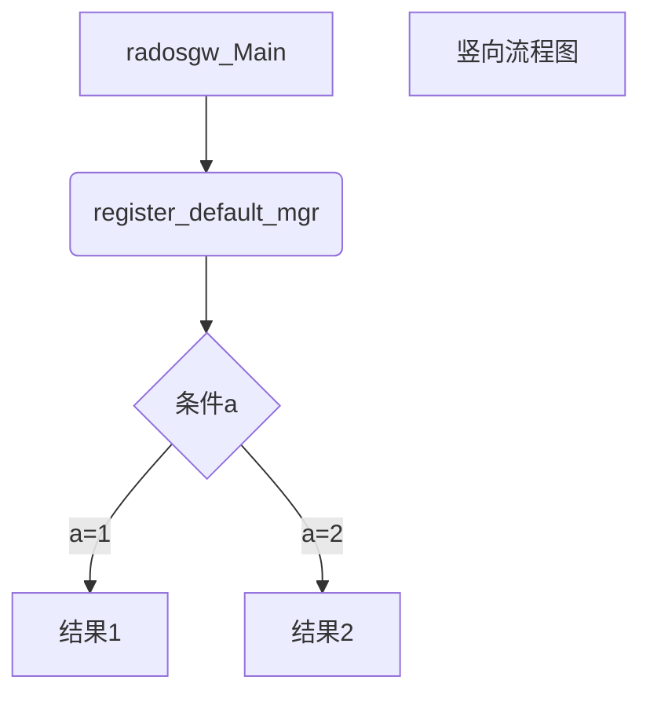

# 问题收集

1. 对象存储到底存储了什么?

2. I/O流程如何?

3. rgw 的请求是什么? 是如何流转的?

4. 请求如何合并？合并后如何还原？需要什么数据结构？

   1. 需要一个映射关系来描述小文件和合并块之间的关系

   2. 为了加速，需要将该映射关系保存在内存中

   3. 映射关系中需要维护的信息：

      ```c++
      String filename;//小文件名
      int	seq;//小文件在block中的序号
      int offset;//小文件在block中的偏移量
      int length;//小文件的大小
      bool dflag;//删除标志位，true表示已删除
      bool pflag;//预取标志位，true
      ```

   4. block的组织方式？

5. 分布式存储与统一存储有什么区别？


ceph提供块存储（RBD）、对象存储（RGW）和文件系统。从架构角度上讲，都是建立在RADOS上。

RBD也是建立在RADOS上，因此每一个块设备都会分布在多个Ceph节点上，以提供高性能和出色的可靠性。

RGW也是建立在RADOS上，提供对象存储接口。对象存储不能像文件系统的磁盘那样直接被操作系统访问，只能通过API在应用层方面访问。

# [Ceph的工作原理及流程](https://www.cnblogs.com/bodhitree/p/4832176.html)

# Ceph公共模块:线程池

## Pthread:

一个线程在创建时调用pthread_create函数来传入entry函数，杀死线程调用pthread_kill函数，当线程被杀死之后，必须调用pthread_join函数来进行线程资源的回收，如果不调用此函数，就会出现类似zombie process。如果要想让系统自己回收线程资源，就要将线程与父线程分离即调用pthread_detach.

```c++
pthread_t pthread_create(pthread_t *__restrict thread,__const pthread_attr_t *__restrict attr, void * (*start_routine)(void *), void *__restrict arg);
pthread_join(threadid,prval);
pthread_detach(threadid);
pthread_kill(t.native_handle(),signal);
```

## Ceph线程池：

对于计算密集型的业务通常使用线程池进行多线程并发处理，线程池在一定程度上可以有效的提高CPU的利用率，降低无用消耗。Ceph中实现了两种类型的线程池类（本质相同），并实现消息队列处理类。其中线程池类负责具体线程创建，维护和销毁。消息队列处理类则负责队列的管理，包括入队，出队等，消息队列类为一个模板类，保证其处理数据类型的通用性。

线程池创建后可以创建指定数量（以参数而定）的线程，而线程会调用其工作函数进行具体的工作。在ThreadPool线程池中，线程的工作函数会调用线程池的worker成员函数进行具体的工作。
线程池的worker成员函数会遍历work_queues，从其中找出每一个消息队列实例，并调用该实例的函数遍历其中保存的消息，并进行消息的具体处理工作。
线程池可以对多种类型的消息队列进行处理，其实现方式是利用了面向对象多态的特性。**线程池成员work_queues本身是一个消息队列超类，而具体使用时的消息队列都有各自的实现。**
另外，为了保证消息队列的灵活性，消息队列超类的入队，出队和处理函数都实现为虚函数，保证具体的处理动作可以由子类实现。

 WorkQueue实现了一部分功能：进队列和出队列，以及加锁，并用通过条件变量通知相应的处理线程。

线程池创建后可以创建指定数量（以参数而定）的线程，而线程会调用其工作函数进行具体的工作。在ThreadPool线程池中，线程的工作函数会调用线程池的worker成员函数进行具体的工作。
线程池的worker成员函数会遍历work_queues，从其中找出每一个消息队列实例，并调用该实例的函数遍历其中保存的消息，并调用WorkQueue_自己定义的函数_``_void_process`和`_void_process_finish`等函数来顺序执行操作.


```c++
//加入wq
add_work_queue(WorkQueue_* wq);

//从wq取出
remove_work_queue(WorkQueue_* wq);

//调用pthread,创建线程
void ThreadPool::start(){
  ldout(cct,10) << "start" << dendl;
  if (_thread_num_option.length()) {
    ldout(cct, 10) << " registering config observer on " << _thread_num_option << dendl;
    cct->_conf.add_observer(this);
  }
  _lock.lock();
  start_threads();
  _lock.unlock();
  ldout(cct,15) << "started" << dendl;
}

/** 线程池的执行函数:
 1）首先检查_stop标志，确保线程池没有关闭。
 2）调用函数join_old_threads把旧的工作线程释放掉。检查如果线程数量大于配置的数量_num_threads，就把当前线程从线程集合中删除，并加入_old_threads队列中，并退出循环。
 3）如果线程池没有暂时中止，并且work_queues不为空，就从last_work_queue开始，遍历每一个工作队列，如果工作队列不为空，就取出一个item，调用工作队列的处理函数做处理
*/
void ThreadPool::worker(WorkThread *wt){
  std::unique_lock ul(_lock);
  ldout(cct,10) << "worker start" << dendl;

  std::stringstream ss;
  ss << name << " thread " << (void *)pthread_self();
  auto hb = cct->get_heartbeat_map()->add_worker(ss.str(), pthread_self());

  while (!_stop) {
    // manage dynamic thread pool
    join_old_threads();
    if (_threads.size() > _num_threads) {
      ldout(cct,1) << " worker shutting down; too many threads (" << _threads.size() << " > " << _num_threads << ")" << dendl;
      _threads.erase(wt);
      _old_threads.push_back(wt);
      break;
    }

    if (!_pause && !work_queues.empty()) {
      WorkQueue_* wq;
      int tries = 2 * work_queues.size();
      bool did = false;
      while (tries--) {
	next_work_queue %= work_queues.size();
	wq = work_queues[next_work_queue++];
	
	void *item = wq->_void_dequeue();
	if (item) {
	  processing++;
	  ldout(cct,12) << "worker wq " << wq->name << " start processing " << item
			<< " (" << processing << " active)" << dendl;
	  ul.unlock();
	  TPHandle tp_handle(cct, hb, wq->timeout_interval, wq->suicide_interval);
	  tp_handle.reset_tp_timeout();
	  wq->_void_process(item, tp_handle);//!!!各子模块虚函数实现各自的功能
	  ul.lock();
	  wq->_void_process_finish(item);
	  processing--;
	  ldout(cct,15) << "worker wq " << wq->name << " done processing " << item
			<< " (" << processing << " active)" << dendl;
	  if (_pause || _draining)
	    _wait_cond.notify_all();
	  did = true;
	  break;
	}
      }
      if (did)
	continue;
    }

    ldout(cct,20) << "worker waiting" << dendl;
    cct->get_heartbeat_map()->reset_timeout(
      hb,
      cct->_conf->threadpool_default_timeout,
      0);
    auto wait = std::chrono::seconds(
      cct->_conf->threadpool_empty_queue_max_wait);
    _cond.wait_for(ul, wait);
  }
  ldout(cct,1) << "worker finish" << dendl;

  cct->get_heartbeat_map()->remove_worker(hb);
}
```

# Ceph rgw

## 处理对象RGWRequest

## 处理请求流程

```c++
//处理请求
rgw_process.cc: 
int ret = process_request(env.store, env.rest, &req, env.uri_prefix,
                            *env.auth_registry, &client_io, env.olog,
                            null_yield, scheduler.get() ,&http_ret);
//获得op
RGWOp* RGWHandler_REST::get_op(void);
//调度器相关
auto schedule_request(Scheduler *scheduler, req_state *s, RGWOp *op);
```


## rgw流程

graph TD
A[方形] -->B(圆角)
  B --> C{条件a}
  C -->|a=1| D[结果1]
  C -->|a=2| E[结果2]
  F[竖向流程图]




## OSD流程

参考： map_message_handling.rst


## [Ceph的架构与硬件平台之间的适应性](https://www.cnblogs.com/bodhitree/p/4832251.html)

Ceph自2006年正式发布以来，其基础架构（RADOS）部分并没有发生大的变化。本质上，这还是因为RADOS的设计确实优秀，有其前瞻性，因此没有必要大动筋骨。但这并不意味着没有必要对其进行适当反思。

如 前所述，2006年的时候，商用处理器的主流仍为单核，单条内存和单块硬盘的容量也都远小于现在的主流水平。但是，OSD的基本硬件资源要求并没有发生变 化。这也就意味着，在目前的典型部署方案中，一台物理服务器上很可能有数十个处理器硬件线程、数十块硬盘，于是也就承载着数十个OSD同时运行。然 而，RADOS结构的基本假定是，集群是由大量的、相互独立运行的OSD组成的，则目前的典型硬件方案有可能影响这种假定的有效性。**例如，如果一台服务器 出现故障，必须关机进行维修，则意味着数十个OSD一起突然下线。由此受到影响的PG则可能多达成千上万个。这种突发性的事件对系统的自动化维护机制可能 会造成一定的压力。**

由 此，笔者想到，Sage设计Ceph时面对的硬件平台，事实上应该是处理能力不需要过强、硬件规格比较简单的系统。而这种系统可能与目前的ARM架构或者 Intel Atom架构的micro-server更为相似。或许，基于micro-server部署Ceph集群，会是一种值得尝试的方向。

此外，华为和希捷合作推出了IP硬盘产品。虽然还缺乏更进一步的了解，但直观上推测，这种全新的、轻量级、智能化的存储设备，可能也是一种非常近似于Sage当年设想中的OSD的硬件平台。

## Ceph与软件定义存储

“软件定义”这四个字可谓是目前最炙手可热、也最让人糊涂的概念之一。软件定义计算、软件定义网络、软件定义存储、软件定义数据中心，以上几个可能是目前最为常见的相关名词了。

到底什么是“软件定义”，现在还没有形成完全一致的见解。并且，参考技术发展史上的若干先例，以后也未必能形成所谓的一致见解。在这种情况下，以一个具体实例入手，可能更容易获得直观认识，并由此建立起更系统的观点。

笔者认为，对于任何一个系统而言，“软件定义”的概念，更多体现在这里：这个系统的哪些特性，比如功能或者性能，以前是固定的，或者只能进行有限的配置，而现在则可以进行方便灵活地定义和改变。

例如，对于一台物理服务器，一旦其硬件配置，如CPU、内存、硬盘等连接好，则这台服务器的规格和性能就确定了，能够通过BIOS配置等方式调整的性能和功 能范围是很有限的。但是，对于一台虚拟机而言，即便在虚拟机已经创建并安装了操作系统之后，其CPU核数及处理能力、逻辑物理内存大小及真实物理内存大 小、硬盘数量容量及读写性能、网卡型号数量及网络带宽等等特性都是可以方便灵活地通过软件方式进行控制和改变的（其中部分配置操作需要对虚拟机进行重启才 能生效），且这种配置可以由应用层软件进行控制。两相对比，则虚拟机的这种可定义性就是软件定义计算的一个直观实例。

下面再具体到存储领域加以讨论。一般而言，一个存储系统的主要特性大致包括：存储类型（文件系统？块存储？对象存储？），存储容量，存储性能（访问带宽、访 问延迟等等），存储策略（备份策略、访问安全性策略、对数据的高级处理功能等等）。参考上面所举出的软件定义计算的例子，可以想见，对于一个软件定义存储 系统而言，这些特性（至少是其中的大多数）都应该是可以通过软件方式加以定义的。

具体到Ceph而言，其最为符合软件定义存储的特性无疑是，Ceph的存储类型是可以通过软件方式定义的。同样的一个RADOS集群，可以通过安装不同的上 层软件和对应的客户端程序，实现块存储、对象存储和文件系统存储功能，这一特性对于传统的存储系统难以想象。除此之外，Ceph的存储策略，如备份策略、 后台数据处理功能等，也都可以方便地通过软件方式加以定义或扩展。因此，从这个角度出发，Ceph也可以被认为是软件定义存储的真实案例之一。

## Ceph与数据中心计算

传统意义上，计算系统的设计是以计算为中心的。数据从存储、网络或其他设备流入处理器，经过处理后再流向存储、网络或其他设备。然而，随着待处理的数据量以 爆炸式的速度增大，也随着计算能力提高的速度超过存储和传输能力，这一处理方式可能变得不再经济，因为针对大量的数据进行频繁硬盘存取和网络传输的代价都 是非常可观的。

数据中心计算这一概念，也就是在这种背景下被提出的。其核心思想，也就是让计算在数据所在的地方发生。数据在哪里，就把计算任务发送到哪里去执行，而不要再 为了使用“强大”的计算能力把数据搬来搬去，传来传去。事实上，Hadoop的出现，就是这种数据中心计算思想的现实反映。

数据中心计算的另一实例，是目前OpenStack社区中出现的一种叫做ZeroVM的轻量级虚拟化技术[1]。ZeroVM的思想就是让计算发生在数据所在的地方。基于其官方提供的信息，目前已经实现了ZeroVM和Swift的整合，可以让处理任务直接运行在Swift的服务器端。

事实上，Ceph也提供了同样的能力。Ceph的整个设计，都是基于Sage的一个基本思想：充分发挥存储器件自身的计算能力。这种思想不仅使得OSD可以 相互配合完成数据访问操作和集群维护功能，更允许OSD将富余的计算能力提供出来，用于运行数据处理任务。

目前，RADOS提供的机制允许在OSD上直接运行可动态加载的数据处理程序插件，以便在服务器端进行数据处理工作，例如，对图片存储系统中的图片进行自动 加水印、尺寸和格式自动转换等后台操作。事实上，基于这种能力，也完全可以实现类似于Hadoop的大数据处理系统。

对于大数据而言，存储和处理是其两个关键的技术领域。由于Ceph自身就是优秀的存储系统，又具备直接承载计算任务的能力，因此，面向大数据的数据中心计算很可能是Ceph的潜在应用方向之一。

## Ceph在实际应用中可能存在的问题

到目前位置，本系列文章基本上都是在介绍Ceph的各种优势与特长。但是，任何系统都不可能是十全十美的，本着鸡蛋里挑骨头、吹毛求疵的精神，还是要在这里吐槽几句。

从非技术角度出发，Ceph的最大问题是火起来的时间不够长，因此可以参考的文档还不是很多，中文的尤其如此。但这个没有办法，只能众人拾柴火焰高，一点一滴作贡献。

此外，对Ceph诟病最多的可能还是不够成熟云云。但一个开源项目总是用得人多了才会成熟的，而Ceph目前正在这个过程中，所以需要的还是时间和参与。

另外，以笔者的感觉，Ceph的高度自动化可能也是个双刃剑。好处固然是很多的，但弊端就是系统的运行状态不完全在管理员控制之下，系统中会有若干自动触发而不是管理员触发的操作。这个特点可能会给系统状态的监测和控制带来一些复杂度，需要管理员去适应。

## 基于Ceph的产业需求和可能的商业机会

```
    特此声明：这一节的内容纯属crazy idea，不构成投资建议:-)
```

首先，Ceph的安装部署和性能优化必然成为突出的需求。因此，将Ceph和商用服务器整合成易于部署、性能出色的各类存储解决方案，应该是可以考虑的方向之一。

同时，由于Ceph自身对于OSD硬件平台的特殊假设，以及由此导致的优化空间，则在成本合理的前提下，开发更加适用于Ceph OSD的定制硬件平台（类似于micro-server或者IP硬盘等），并突出存储的高密度、低功耗、高可维护性等特点，也可能成为一种选择。

此外，针对Ceph集群的专用集群监控、性能分析等工具软件也可能会有一定的需求。

最后，基于Ceph的后台数据处理软件工具包也值得考虑。


