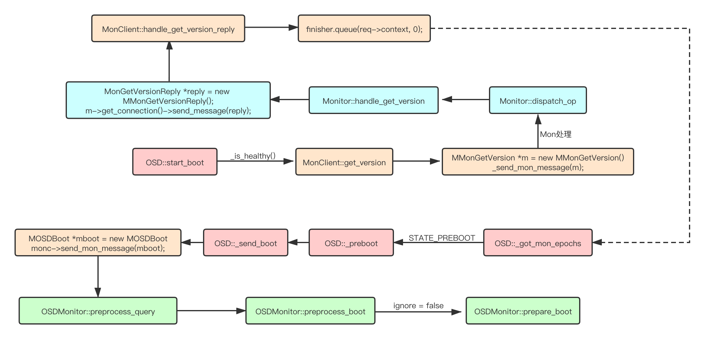

经常会遇到ceph -s告警发生mispaced。这里的原理需要梳理一下。

https://www.cnblogs.com/wujiajun1997/p/14962725.html

# 简介

本文基于`Luminous`版本，分析一下OSD各状态的含义和状态转化关系。OSD的状态类型定义在`osd_state_t`，共有如下几种状态:

```cpp
typedef enum {
    STATE_INITIALIZING = 1,
    STATE_PREBOOT,
    STATE_BOOTING,
    STATE_ACTIVE,
    STATE_STOPPING,
    STATE_WAITING_FOR_HEALTHY
} osd_state_t;
```

对于这些状态，其意义和出现的位置见下表，后文将对每个状态进行详细分析。

| **状态**                    | **意义**                                                     | **位置**                         |
| --------------------------- | ------------------------------------------------------------ | -------------------------------- |
| `STATE_INITIALIZING`        | OSD初始状态；新建OSD对象后，state的默认值。                  | class OSD                        |
| `STATE_PREBOOT`             | OSD准备初始化；在`OSD::start_boot`中发送get_version消息之前设置。 | `OSD::start_boot`                |
| `STATE_BOOTING`             | OSD正在初始化，在`get_version`流程结束后，调用回调在`OSD::_send_boot`中，发送`MOSDBoot`消息之后设置。 | `OSD::_send_boot`                |
| `STATE_ACTIVE`              | OSD变为active状态。                                          | `OSD::_committed_osd_maps`       |
| `STATE_STOPPING`            | OSD开始关闭。                                                | `OSD::shutdown`                  |
| `STATE_WAITING_FOR_HEALTHY` | OSD等待心跳健康。                                            | `OSD::start_waiting_for_healthy` |

# STATE_PREBOOT

`STATE_INITIALIZING`作为新建OSD对象后的初试状态，`STATE_PREBOOT`才是真正意义上的初试状态。当执行`OSD::start_boot`时将OSD状态设置为`STATE_PREBOOT`。首先梳理一下`OSD::start_boot`在哪些地方调用：

- `OSD::init`
- `OSD::tick` ：tick线程对应了OSD中的`SafeTimer tick_timer`。
- `OSD::ms_handle_connect`
- `OSD::_committed_osd_maps`

首先分析一下`OSD::start_boot`的流程，然后再分析一下调用`OSD::start_boot`的逻辑。

## `OSD::start_boot`[#](https://www.cnblogs.com/wujiajun1997/p/14962725.html#osdstart_boot)

当OSD初始化时，调用`OSD::start_boot`进入boot流程。函数具体流程为：

- 处理如果OSD不处于健康的状态的情况，详情参考后文`STATE_WAITING_FOR_HEALTHY`。

- 通过monclient向mon发送`get_version`的消息，获取OSDMap的版本信息，完成后执行回调函数`OSD::_got_mon_epochs`。

- ```
  OSD::_got_mon_epochs
  ```

  调用了

  ```
  OSD::_preboot
  ```

  。

  - 调用`OSD::heartbeat` ，目的是确认容量状态，不会让一个已经标记了full状态的down osd进入boot流程。关于心跳检测可以参考我另外一片blog。
  - OSDMap相关的检测：
    - epoch是否为0
    - OSD是否有`CEPH_OSDMAP_NOUP`标记，有该标记的OSD不能进入up状态。
    - 版本相关信息
    - 判断full信息是否需要更新（通过实际状态和OSDMap中的记录对比），需要的话想mon发送`MOSDFull`消息。
    - 版本检查通过进入`OSD::_send_boot`。
  - 如果没有成功进入`OSD::_send_boot`，调用`osdmap_subscribe`对OSDMap进行更新，之前只获取了版本号相关的信息。

> Q：更新了OSDMap之后呢？
> A：在`OSD::tick`线程中会重新调用`OSD::start_boot`

[](https://img2020.cnblogs.com/blog/2434678/202107/2434678-20210702120821849-192460496.png)

## 在`OSD::init`中调用[#](https://www.cnblogs.com/wujiajun1997/p/14962725.html#在osdinit中调用)

`OSD::init`是OSD启动流程中最主要的函数，在末尾部分会**调用**`**OSD::start_boot**`，可以参考我的[另一篇blog](https://www.cnblogs.com/wujiajun1997/p/14916729.html)，这里不做赘述。

## 在`OSD::tick`中调用[#](https://www.cnblogs.com/wujiajun1997/p/14962725.html#在osdtick中调用)

`OSD::tick`函数的具体流程为：

- 如果是`STATE_ACTIVE`或者`STATE_WAITING_FOR_HEALTHY`，调用`OSD::maybe_update_heartbeat_peers`更新heartbeat peer。
- 如果是`STATE_PREBOOT`或者`STATE_WAITING_FOR_HEALTHY`，**调用**`**OSD::start_boot**`。
- 调用`OSD::do_waiters`对`finished`中的op进行dispatch。相关内容可以参考我的另一篇blog。

## 在`OSD::ms_handle_connect`中调用[#](https://www.cnblogs.com/wujiajun1997/p/14962725.html#在osdms_handle_connect中调用)

`OSD::ms_handle_connect`作为一个继承`Dispatcher`需要复写的函数，调用时机为：

- 连接刚建立
- 连接重新连接

即别的通信组件和OSD刚建立连接或者重连的时候，这两种情况也需要**调用**`**OSD::start_boot**`，使OSD进入Boot流程。具体的逻辑为：

- 如果OSD处于`STATE_PREBOOT`状态将**调用**`**OSD::start_boot**`。
- 如果OSD处于`STATE_BOOTING`状态说明正在boot的过程中，此时调用`OSD::_send_boot`。

## 在`OSD::_committed_osd_maps`中调用[#](https://www.cnblogs.com/wujiajun1997/p/14962725.html#在osd_committed_osd_maps中调用)

在`OSD::_dispatch`中收到OSDMap类型的消息时调用`OSD::handle_osd_map`，将OSDMap本地化事物生成后会注册两个回调：

```cpp
store->queue_transaction(
    service.meta_osr.get(),
    std::move(t),
    new C_OnMapApply(&service, pinned_maps, last),
    new C_OnMapCommit(this, start, last, m), 0);
```

在`queue_transaction`完成后会调用这两个回调类中的finish函数：

- 前者调用`OSDService::clear_map_bl_cache_pins`清理`map_bl_inc_cache`和`map_bl_cache`的缓存。关于这两个缓存可以查看[另一篇blog](https://www.cnblogs.com/wujiajun1997/p/14916729.html)关于OSDMap处理部分。
- 后者调用`OSD::_committed_osd_maps`做新OSDMap相关的处理。

了解了`OSD::_committed_osd_maps`的调用时机，该函数主要进行了三个判断：

- OSD需不需要关闭
- OSD需不需要重启
- 是否有网络错误

这里受限于篇幅原因，只分析和`OSD::start_boot`相关的内容。

```cpp
if (do_shutdown) {
    ...
  }
  else if (m->newest_map && m->newest_map > last) {
    ...
  }
  else if (is_preboot()) {
    if (m->get_source().is_mon())
      _preboot(m->oldest_map, m->newest_map);
    else
      start_boot();
  }
  else if (do_restart)
    start_boot();
```

可以看出

- 如果OSD不需要关闭且在

  ```
  STATE_PREBOOT
  ```

  状态。

  - 如果该OSDMap消息是来自mon，则进入`OSD::_preboot`函数。因为已经有了来自mon的最新OSDMap，无需通过上述的`get_version`去获取OSDMap `epoch`，直接进入`OSD::_preboot`函数。
  - 如果该OSDMap消息是来自osd，则进入`OSD::start_boot`。

- 如果OSD需要重启，也进入`OSD::start_boot`。

# STATE_BOOTING

在`OSD::_send_boot`中设置`STATE_BOOTING`状态，接上文的`OSD::start_boot`之后。主要功能为：

- 获取各类addr，为下一步做准备。
- 向mon发送MOSDBoot消息。

# STATE_STOPPING

在`OSD::shutdown`中设置`STATE_STOPPING`状态，表明OSD处于正在关闭的状态。
在OSDService中还有几个和关闭相关的状态：主要是和OSDService的关闭状态有关。

```cpp
enum {
    NOT_STOPPING,
    PREPARING_TO_STOP,
    STOPPING 
};
```

- `NOT_STOPPING`为默认值

- 在

  ```
  OSDService::prepare_to_stop
  ```

  向mon发送

  ```
  MOSDMarkMeDown
  ```

  类型的消息（要求ack）：

  - 在发送之前设置为`PREPARING_TO_STOP`状态。
  - 发送之后且`is_stopping_cond` Signal后（在`OSDService::got_stop_ack`中收到ack回复后）设置为`STOPPING`状态。

> Q：`OSDService::prepare_to_stop`何时调用？
> A：在L版中是在`OSD::shutdown`中，主要作用是给mon发消息。
> Q：在日志中怎么搜索这种情况？
> A：搜索【telling mon we are shutting down】
> Q：这些状态和OSD的的`STATE_STOPPING`有什么关系？
> A：这三个状态主要用来维护OSDService发送消息的流程，和OSD状态没有太大关系。
> Q：为什么关闭后要给mon发送消息？
> A：需要判断能否mark down，修改OSDMap等工作。详细可以查看`OSDMonitor::preprocess_mark_me_down`和`OSDMonitor::prepare_mark_me_down`。关于Mon的消息处理和同步可以参考我**另外一篇blog**。

# STATE_ACTIVE

`STATE_ACTIVE`表明OSD变为active状态。具体代码在`OSD::_committed_osd_maps`中：

```cpp
epoch_t _bind_epoch = service.get_bind_epoch();
// OSDMap中本OSD为up
  if (osdmap->is_up(whoami) &&
// OSD为新起的OSD
    osdmap->get_addr(whoami) == client_messenger->get_myaddr() &&
    _bind_epoch < osdmap->get_up_from(whoami)) {

  if (is_booting()) {
    dout(1) << "state: booting -> active" << dendl;
      // 设置状态
    set_state(STATE_ACTIVE);

    // set incarnation so that osd_reqid_t's we generate for our
    // objecter requests are unique across restarts.
    service.objecter->set_client_incarnation(osdmap->get_epoch());
  }
}
```

# STATE_WAITING_FOR_HEALTHY

`STATE_WAITING_FOR_HEALTHY`状态的含义为等待心跳健康的阶段，在`OSD::start_waiting_for_healthy`中设置，关于心跳检测**可以参考我的另外一篇blog**。
如何定义健康？在`OSD::start_boot`中对是否健康进行了判断，如果在OSD boot的过程中还处于不健康的状态，不进行boot后续操作。

```cpp
if (!_is_healthy()) {
    // if we are not healthy, do not mark ourselves up (yet)
    dout(1) << "not healthy; waiting to boot" << dendl;
    if (!is_waiting_for_healthy())
      start_waiting_for_healthy();
    // send pings sooner rather than later
    heartbeat_kick();
    return;
  }
```

可以看到判断的关键在`OSD::_is_healthy` 函数，在该函数中有两个判断点：

- 通过`HeartbeatMap::_check`检查所有心跳线程是否超时。

- 检查所有的

  ```
  Heartbeat_peers
  ```

  成员是否健康，如果满足一下任意一个条件则为不健康：

  - 没有收到心跳前peer或后peer的回复。
  - `ping_history`不为空（说明不是没有发送ping消息或者已经接受了所有回复的情况）且现在的时间`now`已经大于`ping_history`的`oldest_deadline`时间。

# 总结

OSD的状态变化和PG相比相对来说比较简单，本文着重分析了流程和主要函数，理解状态变化对理解OSD是至关重要的。
