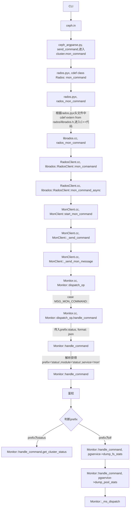

mgr的作用实际上就是分担mon的工作，并且将C++的接口Python化。

问题收集

1. 前端输入的命令如何调用到后台的？

2. 后台如何解析命令？


涉及到：

```shell
src/ceph.in
src/pybind/ceph_argparse.py
src/pybind/rados/rados.pyx
```


ceph命令都是由/usr/bin/ceph来执行的，该文件与ceph.in相同。

```shell
cluster_handle = run_in_thread(rados.Rados,
                                       name=name, clustername=clustername,
                                       conf_defaults=conf_defaults,
                                       conffile=conffile)
retargs = run_in_thread(cluster_handle.conf_parse_argv, childargs)
```

在ceph_argparse.py中，根据不同的任务target，决定执行不同的接口：

```python
def send_command(cluster, target=('mon', ''), cmd=None, inbuf=b'', timeout=0,verbose=False):
  try:
        if target[0] == 'osd':
            osdid = target[1]tail

            if verbose:
                print('submit {0} to osd.{1}'.format(cmd, osdid),
                      file=sys.stderr)
            ret, outbuf, outs = run_in_thread(
                cluster.osd_command, osdid, cmd, inbuf, timeout)

        elif target[0] == 'mgr':
            ret, outbuf, outs = run_in_thread(
                cluster.mgr_command, cmd, inbuf, timeout)

        elif target[0] == 'pg':
            pgid = target[1]
            # pgid will already be in the command for the pg <pgid>
            # form, but for tell <pgid>, we need to put it in
            if cmd:
                cmddict = json.loads(cmd[0])
                cmddict['pgid'] = pgid
            else:
                cmddict = dict(pgid=pgid)
            cmd = [json.dumps(cmddict)]
            if verbose:
                print('submit {0} for pgid {1}'.format(cmd, pgid),
                      file=sys.stderr)
            ret, outbuf, outs = run_in_thread(
                cluster.pg_command, pgid, cmd, inbuf, timeout)

        elif target[0] == 'mon':
            if verbose:
                print('{0} to {1}'.format(cmd, target[0]),
                      file=sys.stderr)
            if len(target) < 2 or target[1] == '':
                ret, outbuf, outs = run_in_thread(
                    cluster.mon_command, cmd, inbuf, timeout)
            else:
                ret, outbuf, outs = run_in_thread(
                    cluster.mon_command, cmd, inbuf, timeout, target[1])
    ...
```

在run_in_thread方法中，可以看到其执行的函数为对应的mon_command、pg_command、osd_command、mgr_command等，并将后面的参数传入：

```python
class RadosThread(threading.Thread):
    def __init__(self, target, *args, **kwargs):
        self.args = args
        self.kwargs = kwargs
        self.target = target
        self.exception = None
        threading.Thread.__init__(self)

    def run(self):
        try:
            self.retval = self.target(*self.args, **self.kwargs)
        except Exception as e:
            self.exception = e
```

以mon_command为例：

此处将进入rados.pyx：（实际上使用了Python与C++之间的交互）：

```python
cdef class Rados(object):
  #前面定义了
  
  def mon_command(self, cmd, inbuf, timeout=0, target=None):
    ...
        """
        mon_command[_target](cmd, inbuf, outbuf, outbuflen, outs, outslen)
        returns (int ret, string outbuf, string outs)
        """
        # NOTE(sileht): timeout is ignored because C API doesn't provide
        # timeout argument, but we keep it for backward compat with old python binding

        self.require_state("connected")
        cmd = cstr_list(cmd, 'c')

        if isinstance(target, int):
        # NOTE(sileht): looks weird but test_monmap_dump pass int
            target = str(target)

        target = cstr(target, 'target', opt=True)
        inbuf = cstr(inbuf, 'inbuf')

        cdef:
            char *_target = opt_str(target)
            char **_cmd = to_bytes_array(cmd)
            size_t _cmdlen = len(cmd)

            char *_inbuf = inbuf
            size_t _inbuf_len = len(inbuf)

            char *_outbuf
            size_t _outbuf_len
            char *_outs
            size_t _outs_len

        try: #实际的调用到rados层的mon_command：
            if target:
                with nogil:
                    ret = rados_mon_command_target(self.cluster, _target,
                                                <const char **>_cmd, _cmdlen,
                                                <const char*>_inbuf, _inbuf_len,
                                                &_outbuf, &_outbuf_len,
                                                &_outs, &_outs_len)
            else:
                with nogil:
                    ret = rados_mon_command(self.cluster,
                                            <const char **>_cmd, _cmdlen,
                                            <const char*>_inbuf, _inbuf_len,
                                            &_outbuf, &_outbuf_len,
                                            &_outs, &_outs_len)

            my_outs = decode_cstr(_outs[:_outs_len])
            my_outbuf = _outbuf[:_outbuf_len]
            if _outs_len:
                rados_buffer_free(_outs)
            if _outbuf_len:
                rados_buffer_free(_outbuf)
            return (ret, my_outbuf, my_outs)
        finally:
            free(_cmd)
```

根据头文件中：

```python
cdef extern from "rados/librados.h" nogil:
```

此时便将要转到C++代码：

```c++
//librados.cc
extern "C" int rados_mon_command(rados_t cluster, const char **cmd,
				 size_t cmdlen,
				 const char *inbuf, size_t inbuflen,
				 char **outbuf, size_t *outbuflen,
				 char **outs, size_t *outslen)
{
  tracepoint(librados, rados_mon_command_enter, cluster, cmdlen, inbuf, inbuflen);
  librados::RadosClient *client = (librados::RadosClient *)cluster;
  bufferlist inbl;
  bufferlist outbl;
  string outstring;
  vector<string> cmdvec;

  for (size_t i = 0; i < cmdlen; i++) {
    tracepoint(librados, rados_mon_command_cmd, cmd[i]);
    cmdvec.push_back(cmd[i]);
  }

  inbl.append(inbuf, inbuflen);
  int ret = client->mon_command(cmdvec, inbl, &outbl, &outstring);//此处进入rados处理流程

  do_out_buffer(outbl, outbuf, outbuflen);
  do_out_buffer(outstring, outs, outslen);
  tracepoint(librados, rados_mon_command_exit, ret, outbuf, outbuflen, outs, outslen);
  return ret;
}
```


```c++
int librados::RadosClient::mon_command(const vector<string>& cmd,
				       const bufferlist &inbl,
				       bufferlist *outbl, string *outs)
{
  C_SaferCond ctx;
  mon_command_async(cmd, inbl, outbl, outs, &ctx);
  return ctx.wait();
}

//接着
void librados::RadosClient::mon_command_async(const vector<string>& cmd,
                                              const bufferlist &inbl,
                                              bufferlist *outbl, string *outs,
                                              Context *on_finish)
{
  lock.Lock();
  monclient.start_mon_command(cmd, inbl, outbl, outs, on_finish);
  lock.Unlock();
}

```


再以mgr_command为例：

```python
def mgr_command(self, cmd, inbuf, timeout=0):        """        returns (int ret, string outbuf, string outs)        """        # NOTE(sileht): timeout is ignored because C API doesn't provide        # timeout argument, but we keep it for backward compat with old python binding        self.require_state("connected")        cmd = cstr_list(cmd, 'cmd')        inbuf = cstr(inbuf, 'inbuf')        cdef:            char **_cmd = to_bytes_array(cmd)            size_t _cmdlen = len(cmd)            char *_inbuf = inbuf            size_t _inbuf_len = len(inbuf)            char *_outbuf            size_t _outbuf_len            char *_outs            size_t _outs_len        try:            with nogil:                ret = rados_mgr_command(self.cluster,                                        <const char **>_cmd, _cmdlen,                                        <const char*>_inbuf, _inbuf_len,                                        &_outbuf, &_outbuf_len,                                        &_outs, &_outs_len)            my_outs = decode_cstr(_outs[:_outs_len])            my_outbuf = _outbuf[:_outbuf_len]            if _outs_len:                rados_buffer_free(_outs)            if _outbuf_len:                rados_buffer_free(_outbuf)            return (ret, my_outbuf, my_outs)        finally:            free(_cmd)
```


再以pg_command为例：

```python
def pg_command(self, pgid, cmd, inbuf, timeout=0):        """        pg_command(pgid, cmd, inbuf, outbuf, outbuflen, outs, outslen)        returns (int ret, string outbuf, string outs)        """        # NOTE(sileht): timeout is ignored because C API doesn't provide        # timeout argument, but we keep it for backward compat with old python binding        self.require_state("connected")        pgid = cstr(pgid, 'pgid')        cmd = cstr_list(cmd, 'cmd')        inbuf = cstr(inbuf, 'inbuf')        cdef:            char *_pgid = pgid            char **_cmd = to_bytes_array(cmd)            size_t _cmdlen = len(cmd)            char *_inbuf = inbuf            size_t _inbuf_len = len(inbuf)            char *_outbuf            size_t _outbuf_len            char *_outs            size_t _outs_len        try:            with nogil:                ret = rados_pg_command(self.cluster, _pgid,                                       <const char **>_cmd, _cmdlen,                                       <const char *>_inbuf, _inbuf_len,                                       &_outbuf, &_outbuf_len,                                       &_outs, &_outs_len)            my_outs = decode_cstr(_outs[:_outs_len])            my_outbuf = _outbuf[:_outbuf_len]            if _outs_len:                rados_buffer_free(_outs)            if _outbuf_len:                rados_buffer_free(_outbuf)            return (ret, my_outbuf, my_outs)        finally:            free(_cmd)
```

对于输入的的API`handle_command mon_command({"prefix": "df", "module": "mon", "perm": "r", "format": "json"} `以及`handle_command mon_command({"prefix": "status", "format": "json"} v 0) v1`，流程图如下所示：



