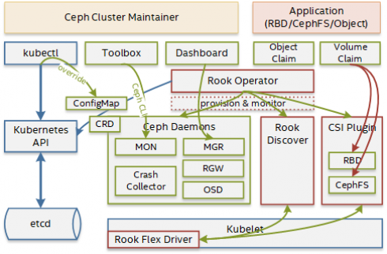

## rook设计


[Introduction to a Cloud-Native Storage Orchestrator: Rook*](https://01.org/kubernetes/blogs/tingjie/2020/introduction-cloud-native-storage-orchestrator-rook)

[k8s部署rook ceph,cluster.yaml,单个image, 指定存储节点主机与磁盘，集群内部访问，集群外部访问](https://www.modb.pro/db/46629)

[自定义K8s Operator](https://www.qikqiak.com/post/k8s-operator-101/)

https://www.cnblogs.com/deny/p/14235814.html




- **Rook Operator** is the core of Rook. The Rook operator is a simple container that automatically bootstraps the storage clusters and monitors the storage daemons to ensure the storage clusters are healthy.
- **Rook Agents** run on each storage node and configure a FlexVolume plugin that integrates with Kubernetes’ volume controller framework. Agents handle all storage operations such as attaching network storage devices, mounting volumes on the host, and formatting the filesystem.
- **Rook Discovers** detect storage devices attached to the storage node.

## MON

不允许每个节点上都运行重复的pod:

rook通过一个自定义参数`allowMultiplePerNode`来限制。

```json
mon:
    count: 3
    allowMultiplePerNode: false
```

MON Pod的创建：

```go
// Reconcile reads that state of the cluster for a CephCluster object and makes changes based on the state read and what is in the cephCluster.Spec
// The Controller will requeue the Request to be processed again if the returned error is non-nil or
// Result.Requeue is true, otherwise upon completion it will remove the work from the queue.
func (r *ReconcileCephCluster) Reconcile(context context.Context, request reconcile.Request) (reconcile.Result, e

func (r *ReconcileCephCluster) reconcile(request reconcile.Request) (reconcile.Result, *cephv1.CephCluster, error) 
	// Do reconcile here!
	ownerInfo := k8sutil.NewOwnerInfo(cephCluster, r.scheme)
	if err := r.clusterController.onAdd(cephCluster, ownerInfo); err != nil {
		return reconcile.Result{}, cephCluster, errors.Wrapf(err, "failed to reconcile cluster %q", cephCluster.Name)
	}

//pkg/operator/ceph/cluster/controller.go
func (c *ClusterController) onAdd(clusterObj *cephv1.CephCluster, ownerInfo *k8sutil.OwnerInfo) 

func (c *ClusterController) initializeCluster(cluster *cluster, clusterObj *cephv1.CephCluster)

func (c *ClusterController) configureLocalCephCluster(cluster *cluster)

func (c *cluster) doOrchestration(rookImage string, cephVersion cephver.CephVersion, spec *cephv1.ClusterSpec)

// Start begins the process of running a cluster of Ceph mons
func (c *Cluster) Start(clusterInfo *cephclient.ClusterInfo, rookVersion string, cephVersion cephver.CephVersion, spec cephv1.ClusterSpec) (*cephclient.ClusterInfo, error)

func (c *Cluster) startMons(targetCount int)

func (c *Cluster) ensureMonsRunning(mons []*monConfig, i, targetCount int, requireAllInQuorum bool)

	f err := c.startDeployments(mons[0:expectedMonCount], requireAllInQuorum); err != nil {


func (c *Cluster) startDeployments(mons []*monConfig, requireAllInQuorum bool)


func (c *Cluster) startMon(m *monConfig, schedule *MonScheduleInfo) 
	d, err := c.makeDeployment(m, false)


func (c *Cluster) makeDeployment(monConfig *monConfig, canary bool) (*apps.Deployment, error)

	pod, err := c.makeMonPod(monConfig, canary)
	
	podSpec := corev1.PodSpec{
		InitContainers: []corev1.Container{
			c.makeChownInitContainer(monConfig),
			c.makeMonFSInitContainer(monConfig),
		},
		Containers: []corev1.Container{
			c.makeMonDaemonContainer(monConfig),
		},
		RestartPolicy: corev1.RestartPolicyAlways,
		// we decide later whether to use a PVC volume or host volumes for mons, so only populate
		// the base volumes at this point.
		Volumes:           controller.DaemonVolumesBase(monConfig.DataPathMap, keyringStoreName),
		HostNetwork:       c.spec.Network.IsHost(),
		PriorityClassName: cephv1.GetMonPriorityClassName(c.spec.PriorityClassNames),
	}

func (c *Cluster) makeMonDaemonContainer(monConfig *monConfig)
```


```go
//pkg/operator/ceph/cluster/mon/spec.go

func (c *Cluster) makeMonDaemonContainer(monConfig *monConfig) corev1.Container {
  podIPEnvVar := "ROOK_POD_IP"
	publicAddr := monConfig.PublicIP

	// Handle the non-default port for host networking. If host networking is not being used,
	// the service created elsewhere will handle the non-default port redirection to the default port inside the container.
	if c.spec.Network.IsHost() && monConfig.Port != DefaultMsgr1Port {
		logger.Warningf("Starting mon %s with host networking on a non-default port %d. The mon must be failed over before enabling msgr2.",
			monConfig.DaemonName, monConfig.Port)
		publicAddr = fmt.Sprintf("%s:%d", publicAddr, monConfig.Port)
	}

	container := corev1.Container{
		Name: "mon",
		Command: []string{
			cephMonCommand,
		},
		Args: append(
			controller.DaemonFlags(c.ClusterInfo, &c.spec, monConfig.DaemonName),
			"--foreground",
			// If the mon is already in the monmap, when the port is left off of --public-addr,
			// it will still advertise on the previous port b/c monmap is saved to mon database.
			config.NewFlag("public-addr", publicAddr),
			// Set '--setuser-match-path' so that existing directory owned by root won't affect the daemon startup.
			// For existing data store owned by root, the daemon will continue to run as root
			//
			// We use 'store.db' here because during an upgrade the init container will set 'ceph:ceph' to monConfig.DataPathMap.ContainerDataDir
			// but inside the permissions will be 'root:root' AND we don't want to chown recursively on the mon data directory
			// We want to avoid potential startup time issue if the store is big
			config.NewFlag("setuser-match-path", path.Join(monConfig.DataPathMap.ContainerDataDir, "store.db")),
		),
		Image:           c.spec.CephVersion.Image,
		VolumeMounts:    controller.DaemonVolumeMounts(monConfig.DataPathMap, keyringStoreName),
		SecurityContext: controller.PodSecurityContext(),
		Ports: []corev1.ContainerPort{
			{
				Name:          "tcp-msgr1",
				ContainerPort: monConfig.Port,
				Protocol:      corev1.ProtocolTCP,
			},
		},
		Env: append(
			controller.DaemonEnvVars(c.spec.CephVersion.Image),
			k8sutil.PodIPEnvVar(podIPEnvVar),
		),
		Resources:     cephv1.GetMonResources(c.spec.Resources),
		LivenessProbe: controller.GenerateLivenessProbeExecDaemon(config.MonType, monConfig.DaemonName),
		WorkingDir:    config.VarLogCephDir,
	}

	// If the liveness probe is enabled
	container = config.ConfigureLivenessProbe(cephv1.KeyMon, container, c.spec.HealthCheck)

	// If host networking is enabled, we don't need a bind addr that is different from the public addr
	if !c.spec.Network.IsHost() {
		// Opposite of the above, --public-bind-addr will *not* still advertise on the previous
		// port, which makes sense because this is the pod IP, which changes with every new pod.
		container.Args = append(container.Args,
			config.NewFlag("public-bind-addr", controller.ContainerEnvVarReference(podIPEnvVar)))
	}

	// Add messenger 2 port
	addContainerPort(container, "tcp-msgr2", 3300)

	return container
}
```


## 配置更改：ConfigMap

```json
kubectl edit configmap rook-ceph-override -n rook-ceph
-------------------------------------
apiVersion: v1
kind: ConfigMap
metadata:
  name: rook-config-override
  namespace: rook-ceph
data:
  config: |
    [global]
    osd crush update on start = false
    osd pool default size = 2
```

 

保存在哪里？在哪里定义？


### Rook的定位

从Rook的官方文档中看出，它的定位是Kubernetes上的存储提供框架，提供基于Kubernetes的多种存储部署，比如：Ceph，Minio，CockroachDB，Cassandra，NFS等。

Ceph只是作为其第一个提供的beta版的存储方案。

参考： [Storage Provider Framework](https://blog.rook.io/rook-v0-8-framework-for-storage-orchestrators-9421848505b3#866f)

### Rook的优势

1. 与Kubernetes集成，一键部署
2. Rook支持通过yaml文件创建pool，cephfs，radosgw，监控等
3. 简单扩容和小版本升级比较方便，kuberctl edit 即可

### Rook的不足

1. Rook项目时间还短，代码不够完善
2. 不支持分区配置OSD，不能准确定制OSD的磁盘使用
3. Rook可以一键删除Ceph pool / cephfs / radosgw和Ceph集群，没有确认，有些危险
4. 基于容器化技术，Ceph的各个组件的IO栈又多了一层，性能会有所损耗
5. Ceph运维增加了Kubernetes一层，对Ceph运维人员的知识栈要求又提高了

### 使用场景总结

所以总体来说如下：

适合使用Rook的场景

- POC环境，测试环境
- Kubernetes + Ceph混合部署环境
- 对Ceph性能没强要求环境
- 不需要经常随社区升级Ceph版本的环境

不适合使用Rook的场景

- Ceph集群单独部署环境
- Ceph性能强需求环境
- 跟随Ceph社区升级版本的环境
